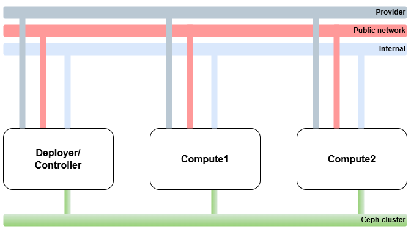
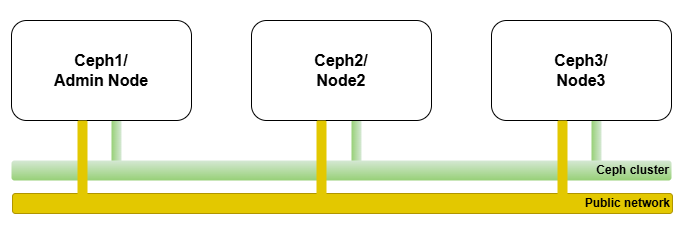
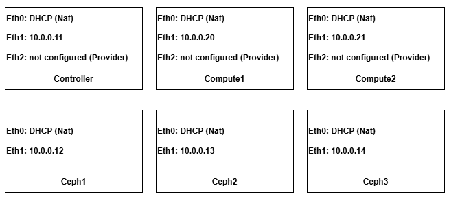

# Openstack
You can access the project full report using this link:
[Openstack_report](https://github.com/zakaryadev03/Openstack/raw/master/Opensatck_Report.pdf)

Repo about deploying multinodes openstack with an external ceph cluster as backend.

the scripts contain the complete setup to deploy openstack with external ceph cluster as backend.
